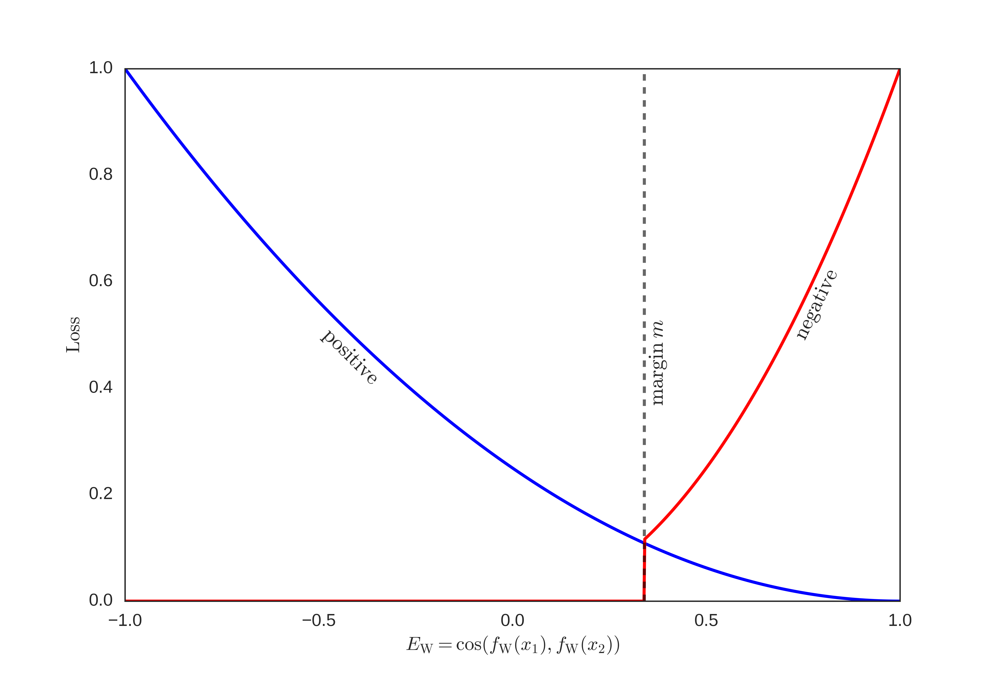

# TextSimilar
短文本相似度
### 孪生网络
[Learning Text Similarity with Siamese Recurrent Networks](http://www.aclweb.org/anthology/W/W16/W16-1617.pdf)  
loss函数
  
数据来源于蚂蚁金融[NLP之问题相似度计算](https://dc.cloud.alipay.com/index#/topic/intro?id=8)  
数据预处理python3 run.py, 在data目录得到data.pkl和vocab.pkl。  
```python
if __name__ == "__main__":
	run(True)
```

#### siamese result
char-LSTM-siamese: precision	0.3748	recall	0.7201	f1	0.493  